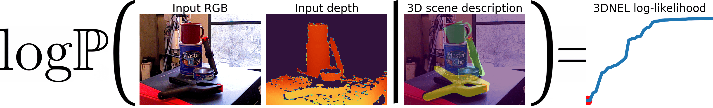

# 3D Neural Embedding Likelihood (3DNEL)



This repo contains code for the paper [3D Neural Embedding Likelihood: Probabilistic Inverse Graphics for Robust 6D Pose Estimation](https://arxiv.org/abs/2302.03744) at the International Conference on Computer Vision (ICCV) 2023.

## Citation

If you find this code useful please consider citing
```
@inproceedings{zhou20233d,
  title={{3D Neural Embedding Likelihood: Probabilistic Inverse Graphics for Robust 6D Pose Estimation}},
  author={Zhou, Guangyao and Gothoskar, Nishad and Wang, Lirui and Tenenbaum, Joshua B and Gutfreund, Dan and L{\'a}zaro-Gredilla, Miguel and George, Dileep and Mansinghka, Vikash K},
  booktitle={Proceedings of the IEEE/CVF International Conference on Computer Vision},
  year={2023}
}
```

## Installation

The code is tested on Debian 11.0 with CUDA 11.8. For other CUDA versions please update the PyTorch dependencies in `environment.yml` accordingly. Reproducing the results requires an NVIDIA GPU with at least 16GB of memory. The code was developed and tested on a machine with a single A100.

### Download data

Set `BOP_DATA_DIR` environment variable to point to the data directory, and use commands below to download and organize relevant data.

```
mkdir -p ${BOP_DATA_DIR}/bop/ycbv
curl -O https://bop.felk.cvut.cz/media/data/bop_datasets/ycbv_base.zip
unzip ycbv_base.zip -d ${BOP_DATA_DIR}/bop
curl -O https://bop.felk.cvut.cz/media/data/bop_datasets/ycbv_test_bop19.zip
unzip ycbv_test_bop19.zip -d ${BOP_DATA_DIR}/bop/ycbv
curl -O https://bop.felk.cvut.cz/media/data/bop_datasets/ycbv_models.zip
unzip ycbv_models.zip -d ${BOP_DATA_DIR}/bop/ycbv
mkdir -p ${BOP_DATA_DIR}/models
curl -L https://github.com/rasmushaugaard/surfemb/releases/download/v0.0.1/ycbv-jwpvdij1.compact.ckpt --output ${BOP_DATA_DIR}/models/ycbv-jwpvdij1.compact.ckpt
curl -OL https://github.com/rasmushaugaard/surfemb/releases/download/v0.0.1/inference_data.zip
unzip inference_data.zip
mv data/* ${BOP_DATA_DIR}/
rm -r data/
```

The resulting directory structure should look as follows:

```
▾ ${BOP_DATA_DIR}/
  ▾ bop/
    ▾ ycbv/
      ▾ models/ % Downloaded and extracted from https://bop.felk.cvut.cz/media/data/bop_datasets/ycbv_models.zip
      ▾ test/ % Downloaded and extracted from https://bop.felk.cvut.cz/media/data/bop_datasets/ycbv_test_bop19.zip
      camera_uw.json % From https://bop.felk.cvut.cz/media/data/bop_datasets/ycbv_base.zip
      test_targets_bop19.json % From https://bop.felk.cvut.cz/media/data/bop_datasets/ycbv_base.zip
  ▾ models/
      ycbv-jwpvdij1.compact.ckpt % Downloaded from https://github.com/rasmushaugaard/surfemb/releases/download/v0.0.1/ycbv-jwpvdij1.compact.ckpt
  ▾ surface_samples/ % Downloaded and extracted from https://github.com/rasmushaugaard/surfemb/releases/download/v0.0.1/inference_data.zip
    ▾ ycbv/
  ▾ detection_results/ % Downloaded and extracted from https://github.com/rasmushaugaard/surfemb/releases/download/v0.0.1/inference_data.zip
    ▾ ycbv/
```

### Setting up the environment on a local machine.


```
conda install mamba -n base -c conda-forge
mamba env create -f environment.yml
conda activate threednel
pip install --upgrade pip
pip install --upgrade "jax[cuda11_pip]" -f https://storage.googleapis.com/jax-releases/jax_cuda_releases.html
python setup.py develop
python upgrade_checkpoint.py
```

Then follow instructions to set up [pararender](https://github.com/nishadgothoskar/pararender).

Alternative, you can reproduce the results using docker (see usage below).

## Usage

### Interactive demo

The notebook `notebooks/inference_with_detector.ipynb` contains an interactive demo of doing 6D object pose estimation of YCB objects in an RGB-D image. The notebook uses an example image from the YCB-V dataset, but can be adapted to work for estimating the poses of YCB objects in any given RGB-D image.

### Reproducing the pose estimations on YCB-V on a local machine

Use
```
XLA_PYTHON_CLIENT_ALLOCATOR=platform python scripts/pose_estimation.py
```
to reproduce the sim-to-real pose estimation results on YCB-V reported in Section 4.1 of the paper.


## Reproducing the pose estimations on YCB-V using docker

After setting up the data directory, use
```
./build_and_run_local.sh
```
to reproduce the sim-to-real pose estimation results on YCB-V reported in Section 4.1 of the paper using docker.

## Evaluating the generated pose estimations on YCB-V

Running the above script would generate a directory under `${BOP_DATA_DIR}/results` containing all the pose estimations on YCB-V, and a `csv` file in the corresponding directory that summarizes the results in BOP format.

Follow instructions at `https://github.com/thodan/bop_toolkit` to set up the `bop_toolkit`, and use
```
python scripts/eval_bop19_pose.py --renderer_type=vispy --result_filenames=NAME_OF_CSV_WITH_RESULTS
```
to evaluate the generated pose estimation results and obtain the average recall numbers reported in the paper.


## License and disclaimer

Copyright 2023 DeepMind Technologies Limited

Copyright 2023 Massachusetts Institute of Technology (M.I.T.)

All software is licensed under the Apache License, Version 2.0 (Apache 2.0);
you may not use this file except in compliance with the Apache 2.0 license.
You may obtain a copy of the Apache 2.0 license at:
https://www.apache.org/licenses/LICENSE-2.0

All other materials are licensed under the Creative Commons Attribution 4.0
International License (CC-BY). You may obtain a copy of the CC-BY license at:
https://creativecommons.org/licenses/by/4.0/legalcode

Unless required by applicable law or agreed to in writing, all software and
materials distributed here under the Apache 2.0 or CC-BY licenses are
distributed on an "AS IS" BASIS, WITHOUT WARRANTIES OR CONDITIONS OF ANY KIND,
either express or implied. See the licenses for the specific language governing
permissions and limitations under those licenses.

This is not an official Google product.
